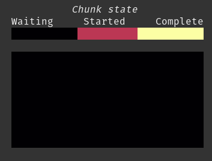

[](https://pypi.org/p/dask-progress-matrix)
[](https://github.com/aazuspan/dask-progress-matrix/actions/workflows/ci.yaml)

Visualize Dask computations by chunk.



## Install

```bash
pip install dask-progress-matrix
```

## Quick-start

### API

#### Local Scheduler

Use `ProgressMatrix` as a context manager to track Dask computations with the local scheduler:

```python
import dask.array as da
from dask_progress_matrix import ProgressMatrix

with ProgressMatrix(cmap="inferno"):
    da.random.random((2, 128, 256), chunks=(1, 16, 16)).compute()
```

#### Distributed Scheduler

For distributed computations, import from `dask_progress_matrix.distributed` and pass your `Client` instance:

```python
import dask.array as da
from distributed import Client
from dask_progress_matrix.distributed import ProgressMatrix

client = Client()  # Connect to your distributed cluster
with ProgressMatrix(client, cmap="inferno"):
    da.random.random((2, 128, 256), chunks=(1, 16, 16)).compute()
```

### CLI

Track Dask computations in any Python file using the CLI. For example, using [uv](https://docs.astral.sh/uv/):

```bash
$ uvx dask-progress-matrix compute_something.py --cmap=inferno
```

## Features

* **Terminal or Jupyter** - Progress matrixes can be displayed in both terminal environments and Jupyter notebooks.

* **Distributed schedulers** - Support for distributed schedulers using `dask.distributed.Client`. Import from `dask_progress_matrix.distributed` to use with distributed clusters.

* **Modes** - When a computation is complete, the `ProgressMatrix` displays a summary with either the completed index or the elapsed time for each chunk, depending on the `mode` parameter.

* **Data structures** - Computing any Dask-backed object will display a progress matrix, including Xarray objects.

* **Dimensionality** - You can track the computation of any Dask array, regardless of dimensionality. For visualization, arrays are truncated to the last two dimensions, so e.g. an array with chunks `(3, 16, 16)` will be rendered as a 16 x 16 matrix where each chunk tracks the progress of 3 different computations.

## Limitations

* **Character width** - Each computation chunk is rendered with a minimum width of 2 characters, so arrays with huge numbers of chunks may render slowly or poorly.

* **Chunk shapes** - All chunks are represented by squares, regardles of their shape.

## FAQ

### Why use a progress matrix?

This was mostly developed out of curiosity, but it has some practical debugging and tuning applications, like identifying chunks that are slow to compute.

### Why does it take a long time to start doing anything?

The progress matrix only tracks terminal tasks that correspond directly to chunks in the computed output array. If your computation has a lot of intermediate tasks, you won't see any progress until those are completed.
